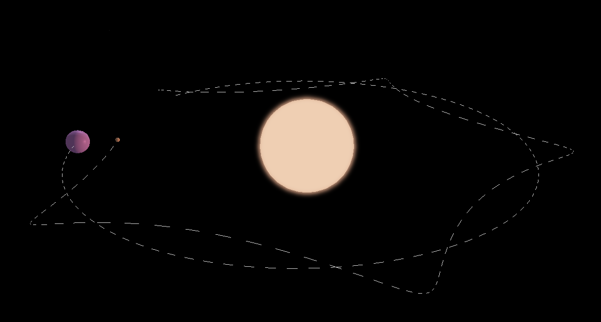
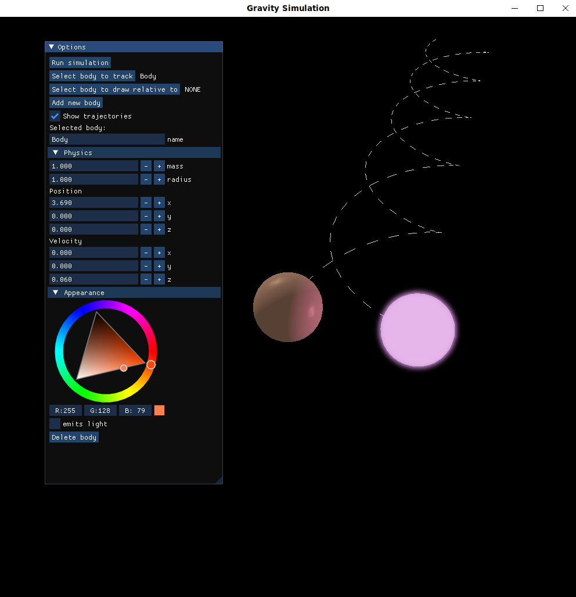
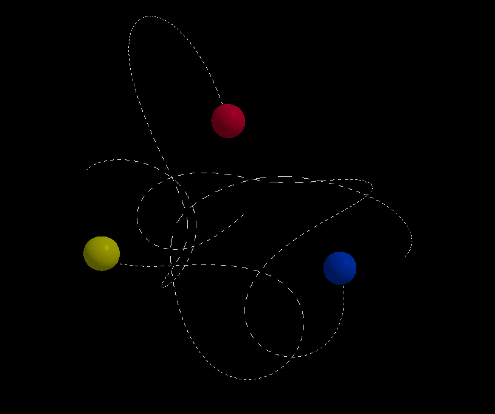
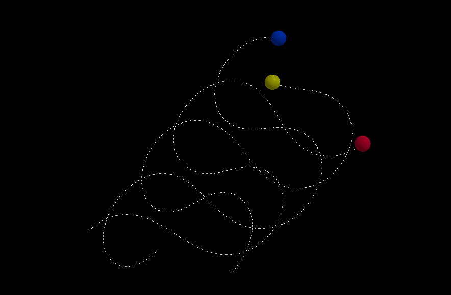
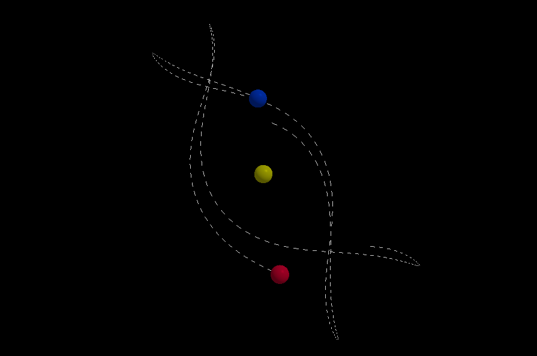
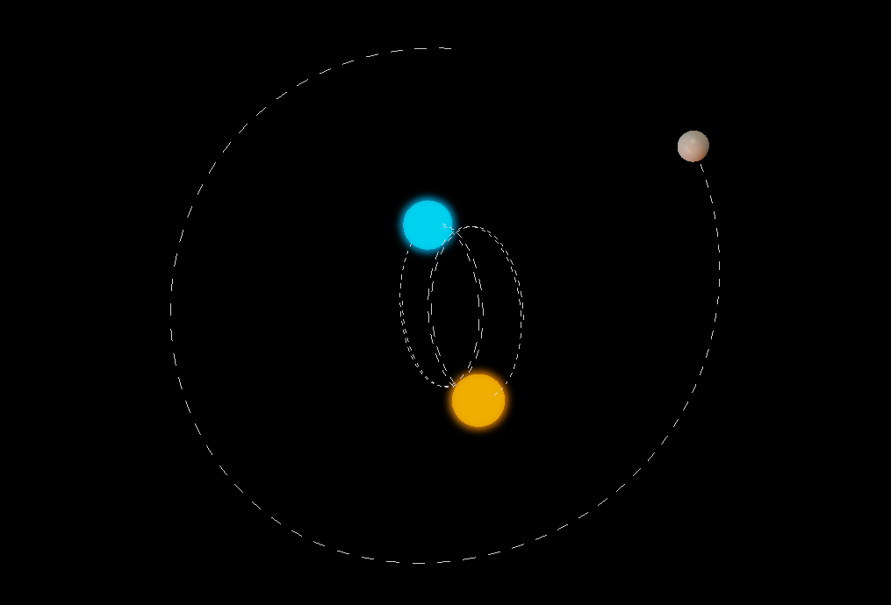
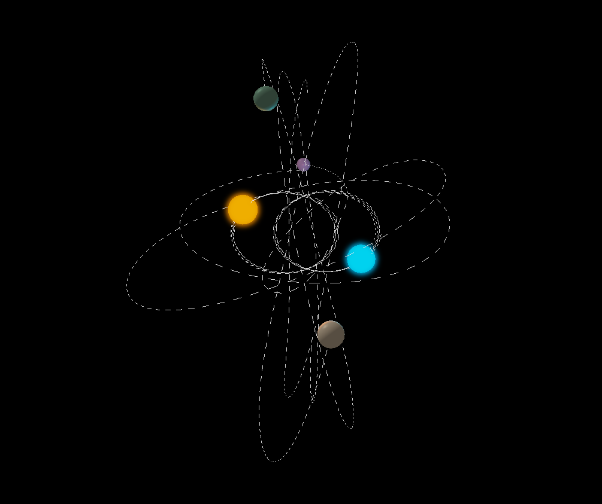
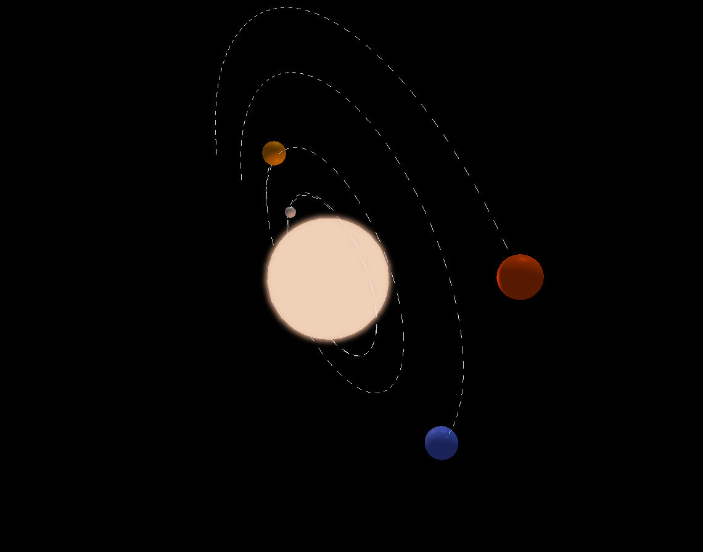

# Gravity Simulation

This is an n-body gravity simulation which I created for educational purposes. My aim was to create a tool which can help to develop an intuitive understanding of Newton's law of universal gravitation in a visually interesting way.

## Building 
Use GNU make:

```make libs && make build```

Requires g++.
Tested on linux, but not macOS or windows.

## Dependencies
* SDL2
* OpenGL
* GLM (in submodule)
* ImGUI (in submodule)

## Screenshots






